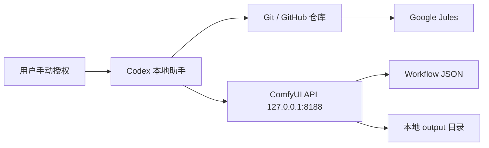

# 星桥协议：Codex × GitHub/Jules × ComfyUI 本地联动方案

> English name: StarBridge Link Protocol

星桥协议是一套本地 AIGC 编程与生成工作流的连接规范。它把 Codex 的本地自动化能力、GitHub/Jules 的异步代码代理能力，以及 ComfyUI 的本地生成能力分成清晰边界，让每个工具只访问它需要访问的内容。

## 目标

- 用 GitHub 保存可公开协作的项目说明、示例脚本和工作流。
- 用 Jules 阅读 GitHub 仓库并提出低风险改进建议。
- 用 Codex 在本机调用 ComfyUI 的 `127.0.0.1:8188` API。
- 用 ComfyUI 负责模型加载、工作流画布和图像生成。
- 避免上传密码、token、Cookie、验证码、支付信息、浏览器数据、模型文件、生成缓存和私人素材。

## 名字含义

“星桥”表示把多个本地与云端工具连接成一条可控链路：

```text
Codex 本地助手
  -> GitHub 仓库
  -> Jules 异步代理
  -> ComfyUI 本地 API
  -> 工作流 JSON / 输出结果
```

桥只传递必要的工程文件，不传递私人凭据。

## 架构



## 安全边界

- Google、GitHub 登录、验证码、订阅、OAuth 授权必须由用户在官方页面手动完成。
- Codex 不保存、不读取、不索要任何账号密码、验证码、Cookie、支付信息或私人 token。
- ComfyUI 只建议监听 `127.0.0.1`，不开放公网。
- 上传 GitHub 的内容只包含文档、示例脚本和工作流 JSON。
- 不上传 `models/`、`output/`、`temp/`、`node_modules/`、日志、缓存、截图、私有素材或授权文件。
- 下载、缓存、临时文件统一放在 `D:\AIGC` 下，便于管理。

## 连接流程

1. 本地环境检查：
   - Git 可用。
   - Node.js / npm 可用。
   - Python 可用。
   - GitHub 网络可访问。
   - 当前项目初始化 Git 仓库并推送到 GitHub。

2. Jules 配置：
   - 进入 `https://jules.google.com/`。
   - 使用 Google AI Pro 对应账号登录。
   - 连接 GitHub。
   - 只授权需要使用的仓库。
   - 第一条任务保持只读，不让 Jules 修改代码。

3. ComfyUI 配置：
   - 使用本地 ComfyUI 路径启动服务。
   - API 地址保持 `http://127.0.0.1:8188`。
   - 通过 `/system_stats` 检查服务和显卡。
   - 通过 `/object_info/CheckpointLoaderSimple` 读取可用 checkpoint。

4. Codex 到 ComfyUI：
   - Codex 读取 workflow JSON。
   - Codex 修改提示词、尺寸、seed、steps、cfg 等参数。
   - Codex POST 到 `/prompt`。
   - Codex 轮询 `/history/{prompt_id}` 获取输出文件名。

## 首条 Jules 任务建议

```text
只读项目梳理任务。请检查这个仓库，但不要修改、创建、删除任何文件，不要提交 commit，不要创建 PR。
请用中文输出：仓库结构概要、入口文件、本地运行方法、依赖文件、应忽略目录、潜在风险，以及 5 个后续安全任务。
这个任务只允许阅读，不允许改文件。
```

## GitHub 上传清单

本协议建议上传：

- `docs/starbridge-link-protocol.md`
- `examples/comfy_bridge/README.md`
- `examples/comfy_bridge/comfy_probe.py`
- `examples/comfy_bridge/run_txt2img.py`
- `examples/comfy_bridge/workflows/txt2img_basic_api.json`
- `examples/comfy_bridge/workflows/txt2img_basic_visual.json`

本协议不建议上传：

- 账号密码、验证码、Cookie、token。
- OAuth 本地缓存和浏览器个人数据。
- ComfyUI 模型、LoRA、VAE、ControlNet、临时缓存。
- 生成图片批量输出和日志。
- 任何包含私人素材、聊天记录或商业未公开素材的文件。

## 后续扩展

- 增加 `img2img` 工作流。
- 增加批量提示词队列。
- 增加 MCP 服务，把 ComfyUI 包装成 Codex 可直接调用的工具。
- 增加工作流校验器，在提交前检查缺失模型和缺失节点。
- 增加自动归档，把每次生成的 prompt、seed、模型名和输出路径写成公开安全的索引。
