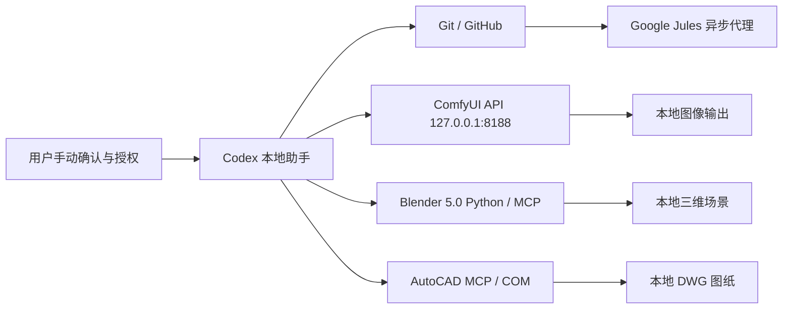

# 星桥三联：Codex 本地创作引擎接入协议

> English name: **StarBridge Trinity Protocol**

星桥三联是一套把 Codex 接入本地创作软件的工作协议。它不是把所有能力混在一起，而是把三条专业通道分清楚：ComfyUI 负责图像生成，Blender 5.0 负责三维场景，CAD 负责工程制图。Codex 作为本地技术助手，负责编写脚本、整理工作流、调用本地 API，并把可公开协作的说明与示例同步到 GitHub。

这套协议的核心目标很简单：让 AI 能帮你操作复杂工具，但不越过安全边界；让工程文件可以分享，但私人账号、模型资产、生成缓存和商业素材不被上传。

## 一句话简介

**星桥三联**把 Codex、GitHub/Jules、ComfyUI、Blender 5.0 和 CAD 连接成一个可审计、可复用、可逐步扩展的本地 AIGC 工作台。

```text
Codex 写脚本和协议
GitHub 保存可公开协作的工程说明
Jules 阅读仓库并给出异步代码建议
ComfyUI 生成图像
Blender 5.0 构建三维场景
CAD 输出工程图纸
```

## 三条桥

### 1. Codex × ComfyUI：图像生成桥

ComfyUI 是本地生成引擎。Codex 通过 `http://127.0.0.1:8188` 调用 ComfyUI API，读取模型列表、提交 workflow JSON、轮询任务历史，并把输出路径反馈给用户。

已建立的公开安全内容：

- API 探针脚本：检查 ComfyUI 是否在线、显卡是否可用、有哪些 checkpoint。
- API 工作流：用于脚本提交任务。
- 可视化工作流：可直接在 ComfyUI 画布里看到节点和连线。
- 下载、缓存、临时目录优先放在 `D:\AIGC`，避免散落到系统盘。

这条桥适合做：

- 文生图、图生图、放大、修复、批量提示词。
- 自动修改 prompt、seed、steps、cfg、尺寸和保存前缀。
- 后续扩展为 MCP 工具，让 Codex 像调用本地函数一样调用 ComfyUI。

### 2. Codex × Blender 5.0：三维场景桥

Blender 5.0 是三维创作引擎。Codex 可以通过 Blender Python 或 MCP 桥接层生成场景、材质、灯光、相机、动画和导出文件。它适合把文字需求转换成可见的三维结构。

这条桥的定位不是替代建模师，而是先生成一个可修改、可验证、可继续打磨的三维初稿。

适合做：

- 快速生成场景草图、产品展示台、空间构图。
- 批量创建材质、灯光、相机和渲染参数。
- 把 ComfyUI 生成的概念图转成三维参考。
- 用脚本生成可重复执行的建模流程。

安全约束：

- 不上传 `.blend` 私有工程、贴图、商业素材和本地资产库，除非用户明确选择。
- GitHub 只保存协议、示例脚本和不含私人素材的说明。
- 大型资产、缓存和渲染输出留在本地 `D:\AIGC`。

### 3. Codex × CAD：工程制图桥

CAD 是精确制图引擎。Codex 通过本地 CAD MCP / COM 自动化层和 AutoCAD 交互，适合把结构化规格转换成线、圆、标注、图层和 DWG 输出。

已建立的方向：

- `cad-mcp-autocad/` 作为 AutoCAD MCP 子项目。
- `AUTOCAD_MCP_SETUP.md` 记录本地配置过程。
- Python 脚本可测试 MCP 工具、绘制矩形和文本，并保存 DWG 文件。

这条桥适合做：

- 根据文字规格生成机械零件草图。
- 自动绘制连接板、孔位、轮廓和尺寸标注。
- 批量生成标准化 CAD 图纸初稿。
- 将艺术、产品或建筑概念转成更精确的工程表达。

安全约束：

- 不上传客户图纸、商业图纸、DWG 输出批量文件或本地 CAD 授权信息。
- GitHub 只保存可复用脚本、协议和不涉密的示例。
- 真实项目图纸留在本地或由用户明确选择后再处理。

## 总体架构



## 工作原则

1. **本地优先**  
   生成、渲染、模型加载、CAD 自动化和三维资产处理都优先在本机完成。

2. **GitHub 只放可公开协作的内容**  
   文档、协议、示例脚本、空工作流模板可以上传；模型、输出图、商业素材、授权文件和隐私数据不上传。

3. **Jules 先读后改**  
   Jules 的第一条任务应当只读仓库，输出结构、入口、运行方法和风险，不直接改代码。

4. **每条桥都有边界**  
   ComfyUI 管图像，Blender 管三维，CAD 管工程图；Codex 负责连接、解释、脚本化和验证。

5. **所有登录和授权都由用户完成**  
   Google、GitHub、验证码、订阅、OAuth、支付和账号风控页面都必须由用户在官方页面手动处理。

## 安全清单

允许上传：

- 协议文档。
- 示例 Python 脚本。
- 不含私人素材的 workflow JSON。
- 不含账号信息的 README。
- 不含真实客户数据的演示配置。

禁止上传：

- 密码、验证码、Cookie、token、OAuth 缓存。
- Google / GitHub 登录资料。
- ComfyUI 模型、LoRA、VAE、ControlNet。
- Blender 私有 `.blend`、贴图、资产库和渲染缓存。
- CAD 商业图纸、客户 DWG、授权文件和真实项目输出。
- 批量生成图片、日志、临时文件、浏览器数据。

## GitHub 当前公开内容

- `docs/starbridge-link-protocol.md`  
  星桥三联协议主文档。

- `examples/comfy_bridge/README.md`  
  ComfyUI 桥接示例说明。

- `examples/comfy_bridge/comfy_probe.py`  
  只读探针：读取 ComfyUI 状态、显卡和 checkpoint。

- `examples/comfy_bridge/run_txt2img.py`  
  文生图提交脚本：通过 ComfyUI API 提交任务并返回输出路径。

- `examples/comfy_bridge/workflows/txt2img_basic_api.json`  
  API 版文生图工作流。

- `examples/comfy_bridge/workflows/txt2img_basic_visual.json`  
  ComfyUI 画布可视化版工作流。

- `AUTOCAD_MCP_SETUP.md`  
  CAD MCP 本地配置说明。

## 第一条 Jules 任务建议

```text
只读项目梳理任务。请检查这个仓库，但不要修改、创建、删除任何文件，不要提交 commit，不要创建 PR。
请用中文输出：仓库结构概要、ComfyUI / Blender / CAD 三条桥的入口文件、运行方法、依赖文件、应忽略目录、潜在风险，以及 5 个后续安全任务。
这个任务只允许阅读，不允许改文件。
```

## 下一步路线

- 为 ComfyUI 增加 `img2img`、放大、修复和批量提示词示例。
- 为 Blender 5.0 增加一个公开安全的场景生成脚本示例。
- 为 CAD 增加一个公开安全的标准零件绘图脚本示例。
- 增加统一的 `bridge_status.py`，一次检查 ComfyUI、Blender 和 CAD 三条桥是否在线。
- 后续将三条桥逐步包装成 MCP 工具，让 Codex 可以稳定调用、记录结果并提示风险。

## 结语

星桥三联不是一个单点工具，而是一种工作方式：把想法交给 Codex 拆解，把协作交给 GitHub 和 Jules，把生成交给 ComfyUI，把空间交给 Blender，把精度交给 CAD。每一条桥都保持清晰边界，既让创作变快，也让工程保持可控。
