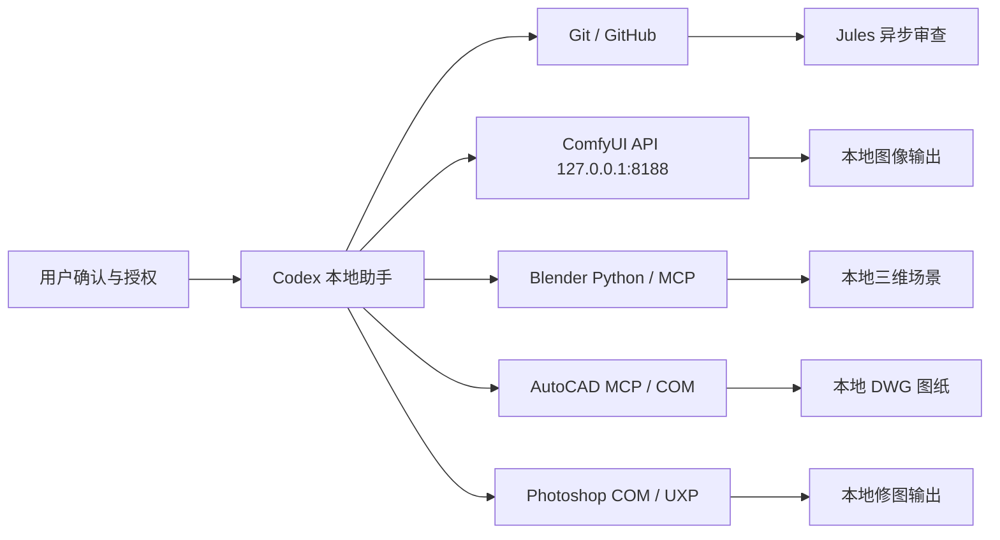

# 星桥三联：Codex 本地创作引擎接入方案

> English name: **StarBridge Trinity Protocol**

星桥三联是一套面向本地创作工作站的接入方案。它把 Codex、GitHub/Jules、ComfyUI、Blender 5.0、CAD 和 Photoshop 放在同一条可追踪的工作链里，让 Codex 负责写脚本、整理流程、调用本地接口和记录结果，让专业软件继续负责各自擅长的创作任务。

## Codex 接入项目总目录

| 编号 | 项目 | 中文介绍 | 当前状态 |
| --- | --- | --- | --- |
| 1 | Codex 接入 CAD | `docs/01-codex-cad.md` | 已有 AutoCAD MCP 子项目和绘图脚本 |
| 2 | Codex 接入 ComfyUI | `docs/02-codex-comfyui.md` | 已有 API 探针、文生图 workflow 示例 |
| 3 | Codex 接入 Photoshop | `docs/03-codex-photoshop.md` | 已有 COM 探针和主体抠图实验脚本 |
| 4 | Codex 接入 Blender | `docs/04-codex-blender.md` | 已有状态检查入口，待补公开安全生成脚本 |

这不是把所有工具混成一个黑盒，而是把能力拆成清楚的几条桥：

- **ComfyUI** 负责图像生成、修复、放大和批量提示词实验。
- **Blender 5.0** 负责三维场景、材质、灯光、相机、动画和导出。
- **CAD / AutoCAD** 负责精确工程制图、尺寸标注、图层和 DWG 输出。
- **Photoshop** 负责修图、主体选择、抠图、图层处理和批量导出。
- **GitHub / Jules** 负责保存可公开协作的说明、示例和异步审查任务。

核心目标只有两个：让 AI 能协助操作复杂创作工具；同时把账号、模型、缓存、客户图纸、商业素材和本地私有资产隔离在 GitHub 之外。

## 快速入口

| 入口 | 用途 |
| --- | --- |
| `docs/01-codex-cad.md` | 1. Codex 接入 CAD 中文介绍 |
| `docs/02-codex-comfyui.md` | 2. Codex 接入 ComfyUI 中文介绍 |
| `docs/03-codex-photoshop.md` | 3. Codex 接入 Photoshop 中文介绍 |
| `docs/04-codex-blender.md` | 4. Codex 接入 Blender 中文介绍 |
| `examples/bridge_status.py` | 一次检查 ComfyUI、Blender、CAD、Photoshop 四条桥的本机状态 |
| `examples/comfy_bridge/` | ComfyUI API 探针、文生图脚本和 workflow 示例 |
| `examples/photoshop_bridge/` | Photoshop COM 探针和主体抠图实验脚本 |
| `cad-mcp-autocad/` | AutoCAD MCP 子项目 |
| `AUTOCAD_MCP_SETUP.md` | AutoCAD MCP 本地配置记录 |
| `docs/codex-drawing-tool-integrations.md` | 绘画、图像、设计、三维、制图工具的扩展路线 |
| `docs/photoshop-codex-bridge.md` | Photoshop 本地桥方案和安全边界 |

本地状态检查：

```powershell
python examples\bridge_status.py
python examples\bridge_status.py --json
python examples\bridge_status.py --probe-executables
```

也可以通过 npm 快捷命令运行：

```powershell
npm.cmd run bridge:status:json
```

如果 PowerShell 拦截 `npm.ps1`，优先使用 `npm.cmd`。

## 本机路径和个人信息处理

公开仓库不保存个人安装路径、素材路径、桌面路径、账号信息或授权信息。每台电脑通过环境变量或本地 `.env` 管理路径，状态脚本只读取这些本地配置。

| 项目 | 环境变量 |
| --- | --- |
| ComfyUI 启动脚本 | `COMFY_LAUNCHER` 或 `COMFY_START_SCRIPT` |
| ComfyUI 根目录 | `COMFY_ROOT` 或 `COMFYUI_PATH` |
| ComfyUI 输出目录 | `COMFY_OUTPUT_DIR` |
| Blender 可执行文件 | `BLENDER_EXE` |
| Blender MCP 桥目录 | `BLENDER_MCP_DIR` |
| AutoCAD 可执行文件 | `AUTOCAD_EXE` |
| Photoshop 可执行文件 | `PHOTOSHOP_EXE` |
| 下载收件箱 | `STARBRIDGE_DOWNLOAD_INBOX` |

模型、生成图、渲染输出、DWG 成品、PSD 工程、临时缓存和本机路径配置不要放进 Git 工作区。

## 总体结构



Codex 只做连接、脚本化、检查和说明沉淀；图像、三维、制图和修图仍交给对应的专业软件完成。

## 四条核心桥

### 1. Codex x ComfyUI：图像生成桥

ComfyUI 是本地生成引擎。Codex 通过 `http://127.0.0.1:8188` 调用 ComfyUI API，读取系统状态、checkpoint 列表、队列状态，提交 workflow JSON，并返回输出路径。

已经具备：

- `examples/comfy_bridge/comfy_probe.py`：只读探针，检查 ComfyUI、显卡和 checkpoint。
- `examples/comfy_bridge/run_txt2img.py`：提交基础文生图 workflow。
- `examples/comfy_bridge/workflows/txt2img_basic_api.json`：API 格式 workflow。
- `examples/comfy_bridge/workflows/txt2img_basic_visual.json`：可在 ComfyUI 画布查看的 workflow。

适合继续扩展：

- 文生图、图生图、局部修复、高清放大。
- 批量 prompt、seed、steps、cfg、尺寸和保存前缀实验。
- ControlNet、IP-Adapter、LoRA、模型管理和 workflow 校验。
- 后续封装成 MCP 工具，让 Codex 像调用本地函数一样调用 ComfyUI。

### 2. Codex x Blender 5.0：三维场景桥

Blender 5.0 是三维创作引擎。Codex 可以通过 Blender Python 或 MCP 桥接层生成场景、模型、材质、灯光、相机、动画和导出文件。

这条桥的定位是快速生成可修改的三维初稿，而不是替代建模师。它更适合把文字需求、结构草图或 ComfyUI 概念图转成可检查、可迭代的三维场景。

适合继续扩展：

- 快速生成产品展示台、空间构图和展陈草图。
- 批量创建材质、灯光、相机和渲染参数。
- 用脚本沉淀可复用建模流程。
- 输出公开安全的示例 `.py`，不引用私有贴图和资产库。

### 3. Codex x CAD：工程制图桥

CAD 是精确制图引擎。Codex 通过本地 CAD MCP / COM 自动化层和 AutoCAD 交互，把结构化规格转换成线、圆、孔位、标注、图层和 DWG 输出。

已经具备：

- `cad-mcp-autocad/`：AutoCAD MCP 子项目。
- `AUTOCAD_MCP_SETUP.md`：本地安装、依赖和 Codex MCP 配置记录。
- `scripts/test_autocad_mcp.py`：MCP 连接测试脚本。
- `scripts/draw_connection_plate_from_spec.py`、`scripts/draw_reference_mechanical_part.py`：直接绘图示例。

适合继续扩展：

- 根据规格生成机械零件草图。
- 自动绘制连接板、孔位、轮廓和尺寸标注。
- 批量生成标准化 CAD 图纸初稿。
- 将艺术、产品或建筑概念转成更精确的工程表达。

### 4. Codex x Photoshop：修图和抠图桥

Photoshop 是修图和图层处理引擎。Codex 可以通过 Windows COM 调用 Photoshop JavaScript，完成最小接入：连接已打开的 Photoshop、创建测试文档、导出 PNG、调用主体选择并生成透明图。

已经具备：

- `docs/photoshop-codex-bridge.md`：Photoshop 本地桥方案、实验结论和安全边界。
- `examples/photoshop_bridge/README.md`：运行说明和边界。
- `examples/photoshop_bridge/scripts/com_probe.ps1`：创建测试文档并导出 PNG。
- `examples/photoshop_bridge/scripts/extract_subject_to_png.ps1`：输入图像转透明 PNG 的主体抠图实验。

适合继续扩展：

- 将主体选择、图层复制、裁切、导出封装成稳定命令。
- 用 UXP 面板读取当前文档、图层和选择状态，再发送到本地桥。
- 增加本地 MCP 工具，让 Codex 能调用 `get_document_info`、`extract_subject`、`export_png` 等安全动作。
- 对复杂背景抠图增加二次蒙版、边缘羽化和人工确认流程。

## 扩展工具方向

星桥三联目前以 ComfyUI、Blender、CAD、Photoshop 为主线。后续可以在同一安全边界下扩展到更多绘画和设计工具：

| 方向 | 适合工具 | 优先级 |
| --- | --- | --- |
| 图像生成与工作流 | ComfyUI、Stable Diffusion、Flux 相关工具 | 高 |
| 三维建模与渲染 | Blender、Blender MCP | 高 |
| 工程制图 | AutoCAD、CAD-MCP | 高 |
| 修图和批处理 | Photoshop COM、Adobe UXP、Photoshop MCP | 高 |
| 设计稿和矢量设计 | Penpot MCP、Figma MCP | 中 |
| 开源画板 | Krita 及其脚本或插件 API | 待评估 |

凡是涉及登录、订阅、验证码、OAuth、浏览器授权、团队权限或账号审批的步骤，都必须由用户在官方页面手动完成。

## 安全边界

允许进入 GitHub：

- 协议文档、README、运行说明。
- 示例 Python 脚本和安全的 workflow JSON。
- 不含私人素材、账号信息和真实客户数据的演示配置。
- 可公开协作的任务说明和 Jules 只读任务提示。

禁止进入 GitHub：

- 密码、验证码、Cookie、token、OAuth 缓存。
- 浏览器资料、支付信息、账号风控页面内容。
- ComfyUI 模型、LoRA、VAE、ControlNet、生成图。
- Blender 私有 `.blend`、贴图、资产库和渲染缓存。
- CAD 客户图纸、商业 DWG、授权文件和真实项目输出。
- Photoshop 安装路径、Creative Cloud 缓存、PSD 私有工程、商业素材、源图路径和导出结果。

## 工作原则

1. **本地优先**
   生成、渲染、模型加载、CAD 自动化和三维资产处理优先在本机完成。

2. **工具分工清楚**
   ComfyUI 管图像，Blender 管三维，CAD 管工程图，Codex 负责连接、解释、脚本化和验证。

3. **GitHub 只保存可公开内容**
   仓库保存协议、脚本和示例，不保存模型、输出、缓存、授权文件和私有素材。

4. **Jules 先读后改**
   Jules 第一条任务应只读仓库，输出结构、入口、运行方法、依赖、风险和后续任务，不直接改文件。

5. **人工处理账号和授权**
   任何登录、订阅、验证码、OAuth、支付、账号审核都不交给自动化流程。

## Jules 只读任务建议

```text
只读项目梳理任务。请检查这个仓库，但不要修改、创建、删除任何文件，不要提交 commit，不要创建 PR。
请用中文输出：仓库结构概要、ComfyUI / Blender / CAD / Photoshop 四条桥的入口文件、运行方法、依赖文件、应忽略目录、潜在风险，以及 5 个后续安全任务。
这个任务只允许阅读，不允许改文件。
```

## 下一步路线

- 完善 `examples/bridge_status.py`，持续识别 ComfyUI、Blender、CAD、Photoshop 的本机配置和在线状态。
- 为 ComfyUI 增加 `img2img`、upscale、inpaint、批量 prompt 和 workflow 校验示例。
- 为 Blender 增加公开安全的场景生成脚本，不引用私有资产。
- 为 CAD 增加标准零件绘图脚本和更清晰的参数化输入格式。
- 继续优化 Photoshop COM 探针、主体抠图、UXP 面板和 MCP 封装，所有个人路径和素材信息只留本机。
- 为 Penpot/Figma、Krita 建立候选接入评估表，先记录来源、许可、依赖、账号要求和安全边界，再决定是否下载或安装。
- 逐步把稳定脚本包装成 MCP 工具，让 Codex 能稳定调用、记录结果并提示风险。

## 结论

星桥三联是一套本地创作工作台的组织方式：Codex 负责把需求拆成脚本和流程，GitHub 保存可公开协作的工程说明，Jules 做异步只读审查，ComfyUI 生成图像，Blender 构建三维，CAD 输出精确图纸，Photoshop 处理修图和抠图。每条桥保持清楚边界，既提升创作效率，也让本地资产和账号安全保持可控。
